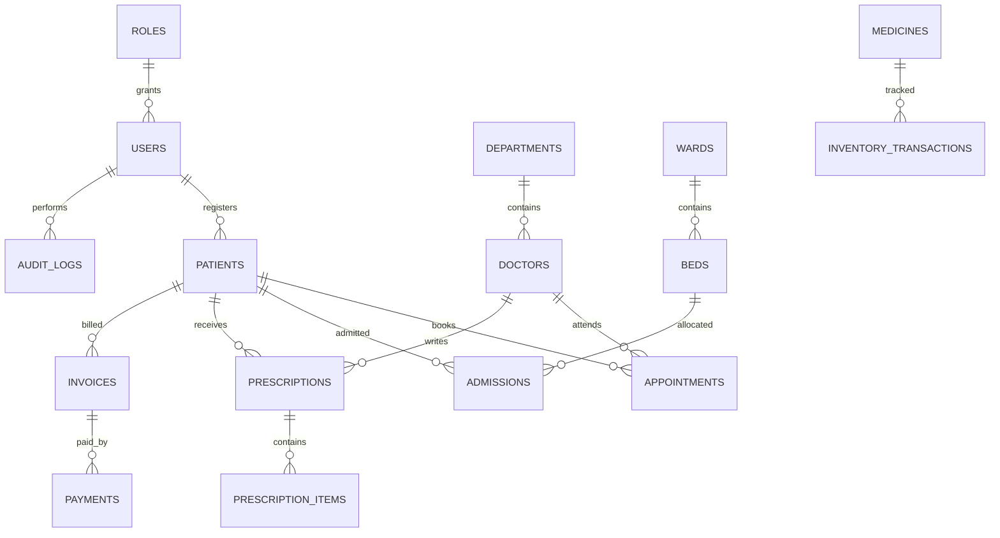

# ER Diagram

```mermaid
erDiagram
 ROLES ||--o{ USERS : grants
 USERS ||--o{ PATIENTS : registers
 DEPARTMENTS ||--o{ DOCTORS : contains
 PATIENTS ||--o{ APPOINTMENTS : books
 DOCTORS ||--o{ APPOINTMENTS : attends
 WARDS ||--o{ BEDS : contains
 BEDS ||--o{ ADMISSIONS : allocated
 PATIENTS ||--o{ ADMISSIONS : admitted
 PATIENTS ||--o{ PRESCRIPTIONS : receives
 DOCTORS ||--o{ PRESCRIPTIONS : writes
 PRESCRIPTIONS ||--o{ PRESCRIPTION_ITEMS : contains
 PATIENTS ||--o{ INVOICES : billed
 INVOICES ||--o{ PAYMENTS : paid_by
 MEDICINES ||--o{ INVENTORY_TRANSACTIONS : tracked
 USERS ||--o{ AUDIT_LOGS : performs
```
